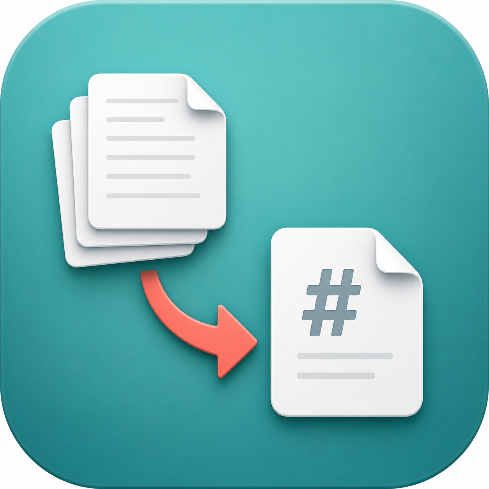

# export-ulysses

[](https://github.com/deverman/export-ulysses/actions/workflows/ci.yml)



Migrate a Ulysses 40 backup into a validated FSNotes library while preserving every recoverable sheet, sidebar note, comment, attachment, image, group, order relationship, and Trash state.

Verified with Ulysses 40 build 83290, macOS 26 Tahoe, Swift 6.3.3, TextBundle v2, and FSNotes. Format changes are reported during preflight: optional metadata drift produces warnings, while structural changes that could silently lose sheet content stop migration by default. Maintainers can inspect an unverified format with the CLI's `--allow-unknown-format` override.

## Choose Your Migration

| You want to... | Start here |
| --- | --- |
| Migrate with a guided Mac interface and no Terminal commands | [Guided Mac App](#guided-mac-app) |
| Migrate from Terminal, a script, or a coding agent | [Command-Line Interface](#command-line-interface) |

The Mac app and CLI use the same migration engine, compatibility checks, and output validator.

## Guided Mac App

This is the recommended path for most people. **Export Ulysses.app** guides you through choosing a backup and destination, checking the migration, and creating the FSNotes files.

### Migrate With The App In 3 Steps

1. **Prepare your libraries.** In Ulysses, choose **Settings > Backup > Backup now** and wait for it to finish. Separately export any Ulysses **External Folders**, because they are not included in a Ulysses backup. Back up your current FSNotes storage before importing anything. See [Ulysses' backup guide](https://help.ulysses.app/backups).

2. **Open the migration app.** Download the notarized release from [GitHub Releases](https://github.com/deverman/export-ulysses/releases), open **Export Ulysses.app**, and choose your `.ulbackup` package. For the destination, choose a parent folder; the app creates a new `FSNotes Ulysses Migration` folder inside it. The direct-download app can discover the newest local backup, while the App Store version asks you to select it because of macOS privacy protections.

3. **Check, then migrate.** Select **Run Preflight**, review any warnings, and select **Migrate to FSNotes**. Do not import the result until the app reports that validation passed.

If the app cannot find a backup, leave Ulysses open for at least five minutes after choosing **Backup now**, then select **Check Again**. You can also select **Choose** and locate a backup with **Ulysses > File > Browse Backups > Reveal in Finder**. Local Ulysses backups do not sync between Macs.

Continue with [Add The Migration To FSNotes](#add-the-migration-to-fsnotes) after the export succeeds.

## Command-Line Interface

The CLI is intended for developers, Terminal users, scripts, and coding agents. It exposes the same preflight and migration behavior as the Mac app without depending on SwiftUI.

### Install The CLI

Download the notarized command-line tool from [GitHub Releases](https://github.com/deverman/export-ulysses/releases), or build it from source with Swift 6.3.3:

```sh
git clone https://github.com/deverman/export-ulysses.git
cd export-ulysses
swift build -c release
alias export-ulysses="$PWD/.build/release/export-ulysses"
```

### Migrate With The CLI In 3 Steps

1. **Create a current backup.** In Ulysses, choose **Settings > Backup > Backup now**. Separately export External Folders and back up the existing FSNotes storage.

2. **Run preflight.** Check the backup format, destination, free space, and expected migration totals before writing notes:

   ```sh
   export-ulysses doctor --output "$HOME/Documents/FSNotes Ulysses Migration"
   ```

3. **Create the migration.** Use the same new destination after preflight succeeds:

   ```sh
   export-ulysses migrate "$HOME/Documents/FSNotes Ulysses Migration"
   ```

The CLI selects the newest readable local `.ulbackup` by default. Use `--backup "/path/to/Backup.ulbackup"` for another backup. Processing defaults to `--jobs 2`; raise it explicitly only when needed.

```text
export-ulysses doctor [--backup PATH] [--output PATH] [--jobs 2]
export-ulysses migrate OUTPUT [--backup PATH] [--jobs 2]
export-ulysses --version
```

`--allow-unknown-format` is a developer escape hatch, not a migration recommendation. It permits investigation of format drift but cannot make an unknown schema trustworthy.

### Automation And Coding Agents

- Use explicit absolute paths for `--backup` and the migration output instead of relying on backup discovery.
- Run `doctor` first and stop if it returns a failure. Do not automatically retry with `--allow-unknown-format`.
- Use a new destination folder. The exporter deliberately refuses to merge into or replace existing output.
- Treat the visible migration report and private manifest as personal data. The anonymous support JSON under `.export-ulysses/` is the file intended for public bug reports.
- Review [Compatibility](docs/COMPATIBILITY.md), [Validation](docs/VALIDATION.md), and [Troubleshooting](docs/TROUBLESHOOTING.md) before building unattended workflows.

For project work, see [Development and dependencies](docs/DEVELOPMENT.md), [Contributing](CONTRIBUTING.md), [Security and privacy](SECURITY.md), the [release checklist](docs/RELEASE_CHECKLIST.md), and the [Mac App Store architecture](docs/APP_STORE.md).

## Add The Migration To FSNotes

**If you already use FSNotes, keep your current Default Storage.** The least disruptive approach is to choose that existing storage folder as the destination parent in Export Ulysses. The app creates a new `FSNotes Ulysses Migration` child folder, so imported notes stay together and FSNotes discovers them without replacing or mixing them with your existing files. If you exported elsewhere, add the migration folder as an external folder for review, or move the complete folder under your existing Default Storage while FSNotes is closed.

FSNotes only treats its configured Trash folder as system Trash. To retain the Ulysses trash state in an existing library, first verify **FSNotes > Settings > Advanced > Trash**, then move the TextBundles inside the migration's `Trash` folder into that existing FSNotes Trash folder. Review them before using **Empty Trash**. Leaving them in the nested migration `Trash` folder preserves the files on disk, but FSNotes may not display them.

**For a new or empty FSNotes installation**, select the migration folder as **FSNotes > Settings > General > Default Storage**, then set **Settings > Advanced > Trash** to its `Trash` subfolder. This gives migrated Ulysses Inbox and Trash sheets native FSNotes Inbox and Trash behavior.

## What Is Preserved

| Ulysses data | FSNotes result |
| --- | --- |
| Sheets and Markdown-compatible formatting | One TextBundle v2 note per sheet |
| Inline images and file attachments | Copied into each bundle's `assets/` and linked relatively |
| Sheet notes | Appended to the same note under `## Ulysses Sidebar Notes`, with each note numbered |
| Inline and block comments | Kept at their original text positions as visible `Ulysses comment` markers |
| Annotations | Annotated text stays in place and the annotation follows as a visible `Ulysses annotation` marker |
| Keywords | Searchable hashtags |
| Groups and projects | FSNotes folders with deterministic collision handling |
| Inbox | Root when used as a new Default Storage; contained in the migration folder when added to an existing library |
| Trash | Exported to `Trash/`; use it as the new library's Trash or move its contents into an existing library's configured Trash |
| Archive and Templates | Folders plus `#ulysses/archive` and `#ulysses/template` |
| Material, glued, favorite status | `#ulysses/material`, `#ulysses/glued`, and `#ulysses/favorite` |
| Sheet order and glued clusters | Consolidated `Ulysses Library Map` with FSNotes links |
| Saved filters | Visible migration note with scope and query description |
| Group icons, colors, goals, activity | Consolidated visible metadata note |
| Creation and modification dates | TextBundle metadata and filesystem dates |

FSNotes has no portable TextBundle field for native pins, Ulysses goals, group colors/icons, or per-folder sort settings. Those values are kept visibly rather than pretending FSNotes can recreate the Ulysses UI.

### Where Notes And Annotations Go

Ulysses sheet notes are not discarded or moved into separate FSNotes notes. They are appended near the end of the same exported sheet under `## Ulysses Sidebar Notes`, with headings such as `### Note 1`. Links and supported formatting inside the note remain Markdown.

Ulysses comments and annotations remain beside the text they describe:

- Inline comments become `**[Ulysses comment: ...]**` at the original position.
- Comment paragraphs become `> **Ulysses comment:** ...` blockquotes.
- Annotations keep the annotated text and add `**[Ulysses annotation: ...]**` immediately after it.

FSNotes does not have Ulysses' Annotations sidebar or attachment-note interface, so these values are intentionally visible in the Markdown. Ulysses may show notes, comments, and annotations from several glued sheets together in its sidebar. The exporter creates one TextBundle per sheet, so each item appears in the sheet that owns it. Use `Ulysses Library Map` to see which separate FSNotes notes belonged to the same glued cluster.

## Known Limits

- Only Ulysses 40 build 83290 backups are currently verified. Preflight reports format drift before migration.
- Ulysses External Folders are not stored in `.ulbackup` packages and must be migrated separately.
- Media bytes missing from the backup cannot be recreated. The migration report identifies every unresolved reference.
- Some Ulysses concepts have no native FSNotes equivalent; the exporter preserves them as visible tags and migration notes instead.
- An external FSNotes folder does not receive native Inbox or Trash behavior. See [Add The Migration To FSNotes](#add-the-migration-to-fsnotes).

## Safety Model

- `doctor` performs format fingerprinting, a complete dry run, destination checks, and a free-space check.
- `migrate` always includes all groups and sheets. There is no omission flag.
- Every sheet is parsed before publishing output.
- Output is built in a hidden staging directory, validated, and moved into place only after all TextBundles and asset links pass.
- A malformed sheet, changed structural XML node, changed plist type, missing `Content.xml`, or unknown store version stops the migration.
- `.export-ulysses/ulysses-export-report.json` is anonymous and excludes titles, filenames, URLs, filesystem paths, and note contents.
- The private `.export-ulysses/manifest.json` and visible Ulysses Export Report contain actionable migration details. Do not attach those publicly without reviewing them.

## Output

```text
FSNotes Ulysses Migration/
  A Sheet.textbundle/
    text.markdown
    info.json
    assets/
  Trash/
  Archive (Ulysses)/
  _Ulysses Migration/
  .export-ulysses/
```

The `_Ulysses Migration` folder contains at most five companion notes: export report, library map, group metadata, favorites, and saved filters. After reviewing it in FSNotes, disable **Show notes in Notes and Todo lists** for that folder.

## Getting Help

- [Troubleshooting and FAQ](docs/TROUBLESHOOTING.md)
- [Compatibility policy](docs/COMPATIBILITY.md)
- [Security and privacy](SECURITY.md)

When filing an issue, attach only `.export-ulysses/ulysses-export-report.json` unless a maintainer specifically requests privately reviewed evidence.

Export Ulysses is an independent migration utility and is not affiliated with the developers of Ulysses or FSNotes. Product names and trademarks belong to their respective owners.
